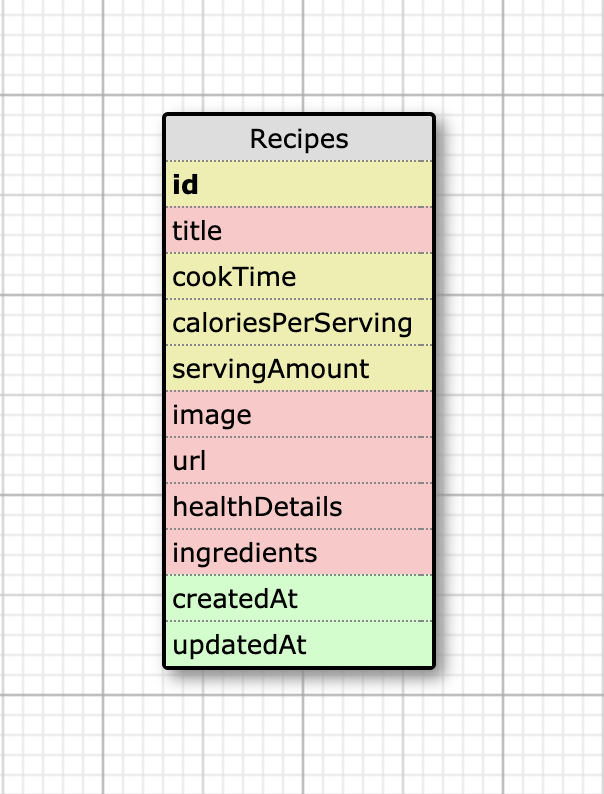

# Om-Nom-Edamam

The _Om-Nom-Edamam_ API represents the micro-service component of the Quantified Self paired project, which itself is a component of the fourth module of the Back-End Engineering program at the Turing School of Software and Design. The project uses backend JavaScript technologies (NodeJS and Express) to build out a food tracking API which relies heavily on the recipe and nutrition aggregation company Edamam and their Recipe Search API. Learning goals for this project include:

* Creating an Express API given specified endpoints
and response formats
* Create a micro-service that interfaces with the Edamam API
* Integrate both apps together

The primary API, _Om-Nom_, is located at:
https://omm-nomm.herokuapp.com/

The micro-service, _Om-Nom-Edamam_ (which this documentation relates to, also written in Express) is located at:
https://om-nom-edamam.herokuapp.com/

## Usage

Recipes are the singular focus of the Om-Nom-Edamam micro-service. The following endpoints display recipe data based on user input.

#### Search by Food
Get a list of recipes associated with a food item.
```
  GET /api/v1/recipes/food_search
```
##### Parameters
| params | Description |
|--------|-------------|
|    q   | Search term |

##### Response
```
200 OK
Link: <https://om-nom-edamam.herokuapp.com/api/v1/food_search?q=chicken>
```
```
{
  "recipes": [
    {
      "title": "Chicken Vesuvio",
      "cook_time": 60,
      "calories_per_serving": 720,
      "serving_amount": 6
      "image": "https://www.edamam.com/web-img/e42/e42f9119813e890af34c259785ae1cfb.jpg",
      "url": "http://www.seriouseats.com/recipes/2011/12/chicken-vesuvio-recipe.html",
      "health_details": [
          "peanut-free",
          "tree-nut-free"
      ],
      "ingredients": [
          "1/2 cup olive oil",
          "5 cloves garlic, peeled",
          "2 large russet potatoes, peeled and cut into chunks",
          "1 3-4 pound chicken, cut into 8 pieces (or 3 pound chicken legs)",
          "3/4 cup white wine",
          "3/4 cup chicken stock",
          "3 tablespoons chopped parsley",
          "1 tablespoon dried oregano",
          "Salt and pepper",
          "1 cup frozen peas, thawed"
      ],
    },

    ... More Recipes

  ]
}
```

---
#### Search by Calories per Serving
Get a collection of recipes where calories per serving is within a given range.
```
  GET /api/v1/recipes/calorie_search
```
##### Parameters
| params | Description |
|--------|-------------|
|    q   | Range of calories (written as _min-max_) |

##### Response
```
200 OK
Link: <https://om-nom-edamam.herokuapp.com/api/v1/calorie_search?q=700-800>
```

```
{
  "recipes": [
    {
      "title": "Chicken Vesuvio",
      "cook_time": 60,
      "calories_per_serving": 720,
      "serving_amount": 6
      "image": "https://www.edamam.com/web-img/e42/e42f9119813e890af34c259785ae1cfb.jpg",
      "url": "http://www.seriouseats.com/recipes/2011/12/chicken-vesuvio-recipe.html",
      "health_details": [
          "peanut-free",
          "tree-nut-free"
      ],
      "ingredients": [
          "1/2 cup olive oil",
          "5 cloves garlic, peeled",
          "2 large russet potatoes, peeled and cut into chunks",
          "1 3-4 pound chicken, cut into 8 pieces (or 3 pound chicken legs)",
          "3/4 cup white wine",
          "3/4 cup chicken stock",
          "3 tablespoons chopped parsley",
          "1 tablespoon dried oregano",
          "Salt and pepper",
          "1 cup frozen peas, thawed"
      ],
    },

    ... More Recipes

  ]
}
```
---
#### Search by Health Concern
Get a collection of recipes catering to a health concern.
```
  GET /api/v1/recipes/health_search
```
##### Parameters
| params | Description |
|--------|-------------|
|    q   | Health concern (written as "[concern]-free") |

Note: examples of concerns include tree-nut, peanut, and alcohol

##### Response
```
200 OK
Link: <https://om-nom-edamam.herokuapp.com/api/v1/health_search?q=peanut-free>
```
```
{
  "recipes": [
    {
      "title": "Chicken Vesuvio",
      "cook_time": 60,
      "calories_per_serving": 720,
      "serving_amount": 6
      "image": "https://www.edamam.com/web-img/e42/e42f9119813e890af34c259785ae1cfb.jpg",
      "url": "http://www.seriouseats.com/recipes/2011/12/chicken-vesuvio-recipe.html",
      "health_details": [
          "peanut-free",
          "tree-nut-free"
      ],
      "ingredients": [
          "1/2 cup olive oil",
          "5 cloves garlic, peeled",
          "2 large russet potatoes, peeled and cut into chunks",
          "1 3-4 pound chicken, cut into 8 pieces (or 3 pound chicken legs)",
          "3/4 cup white wine",
          "3/4 cup chicken stock",
          "3 tablespoons chopped parsley",
          "1 tablespoon dried oregano",
          "Salt and pepper",
          "1 cup frozen peas, thawed"
      ],
    },

    ... More Recipes

  ]
}
```
---
#### Sort By Cook Time
Get a collection of recipes associated with a food item and ordered by cook time.
```
  GET /api/v1/recipes/time_sort
```
##### Parameters
| params | Description |
|--------|-------------|
|    q   | Search term |

Note: Recipe cook time is displayed in minutes

##### Response
```
200 OK
Link: <https://om-nom-edamam.herokuapp.com/api/v1/time_sort?q=chicken>
```
```
{
  "recipes": [
    {
      "title": "Chicken Vesuvio",
      "cook_time": 60,
      "calories_per_serving": 720,
      "serving_amount": 6
      "image": "https://www.edamam.com/web-img/e42/e42f9119813e890af34c259785ae1cfb.jpg",
      "url": "http://www.seriouseats.com/recipes/2011/12/chicken-vesuvio-recipe.html",
      "health_details": [
          "peanut-free",
          "tree-nut-free"
      ],
      "ingredients": [
          "1/2 cup olive oil",
          "5 cloves garlic, peeled",
          "2 large russet potatoes, peeled and cut into chunks",
          "1 3-4 pound chicken, cut into 8 pieces (or 3 pound chicken legs)",
          "3/4 cup white wine",
          "3/4 cup chicken stock",
          "3 tablespoons chopped parsley",
          "1 tablespoon dried oregano",
          "Salt and pepper",
          "1 cup frozen peas, thawed"
      ],
    },

    ... More Recipes

  ]
}
```
#### Sort by Calories per Serving
Get a collection of recipes associated with a food item and sorted by calories per serving.
```
  GET /api/v1/recipes/calorie_sort
```
##### Parameters
| params | Description |
|--------|-------------|
|    q   | Search term |

Note: Results will appear in ascending order.
##### Response
```
200 OK
Link: <https://om-nom-edamam.herokuapp.com/api/v1/calorie_sort?q=chicken>
```
```
{
  "recipes": [
    {
      "title": "Chicken Vesuvio",
      "cook_time": 60,
      "calories_per_serving": 720,
      "serving_amount": 6
      "image": "https://www.edamam.com/web-img/e42/e42f9119813e890af34c259785ae1cfb.jpg",
      "url": "http://www.seriouseats.com/recipes/2011/12/chicken-vesuvio-recipe.html",
      "health_details": [
          "peanut-free",
          "tree-nut-free"
      ],
      "ingredients": [
          "1/2 cup olive oil",
          "5 cloves garlic, peeled",
          "2 large russet potatoes, peeled and cut into chunks",
          "1 3-4 pound chicken, cut into 8 pieces (or 3 pound chicken legs)",
          "3/4 cup white wine",
          "3/4 cup chicken stock",
          "3 tablespoons chopped parsley",
          "1 tablespoon dried oregano",
          "Salt and pepper",
          "1 cup frozen peas, thawed"
      ],
    },

    ... More Recipes

  ]
}
```

## Database

The database uses PostgreSQL. The "Recipes" table stands alone in this database and is shown below.



## Tech Stack

This application uses:
Node version 10.16.2
Express version 4.16.4
Sequelize version 5.15.0
Jest version 24.9.0
DOTENV version 8.1.0
PostgreSQL version 7.12.1

## Initial Set Up and Testing

Feel free to clone this API's repository. Once cloned, run the following commands to install the necessary packages and set up the application.

`npm install`\
`npx sequelize db:create`\
`npx sequelize db:migrate`\
`npx sequelize db:seed:all`

Jest was used for testing for this application. To run the test suite, run `npm test`.

## Contributors

This was a paired project. The two contributors and their GitHub account information are shown below.

Martin Mercer \
https://github.com/m-mrcr

Earl Stephens \
https://github.com/earl-stephens

## How to Contribute

If you would desire to contribute to the project, fork the project from the
master branch. You may then make changes you deem appropriate and
submit a pull request. Please provide a detailed explanation of what feature, problem, or bug fix you are presenting.
